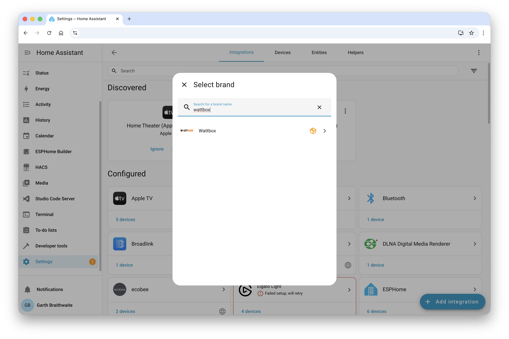
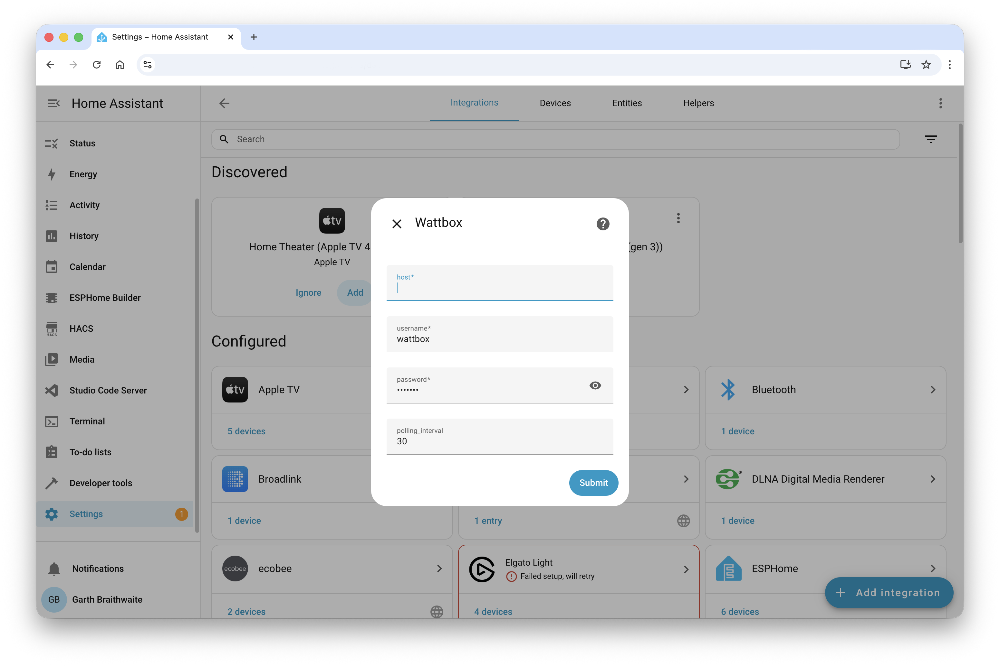
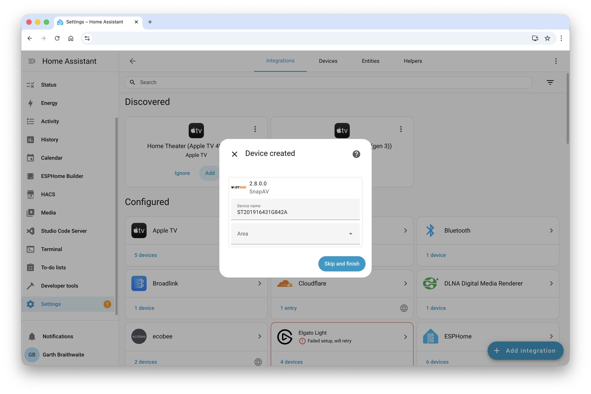
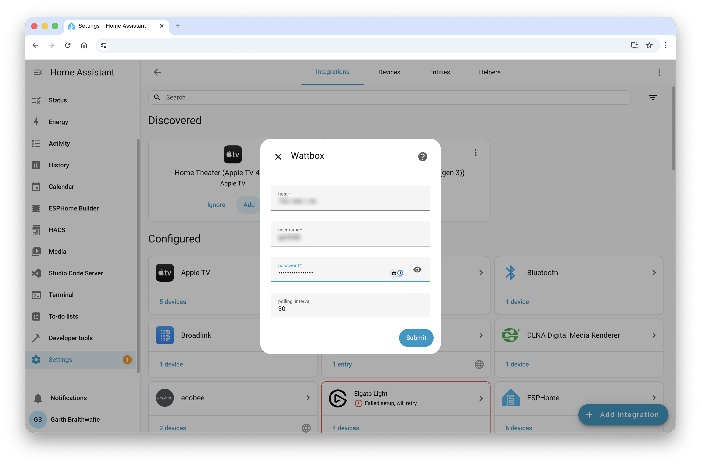
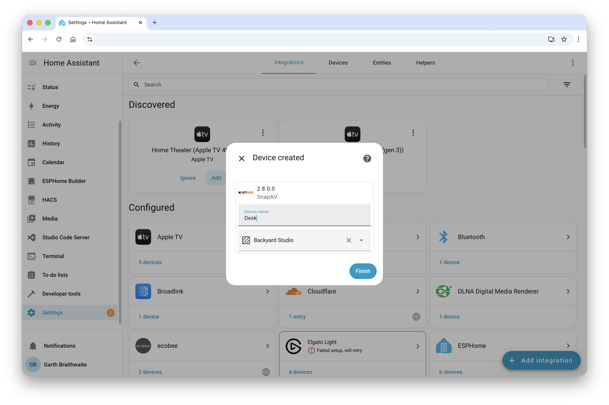
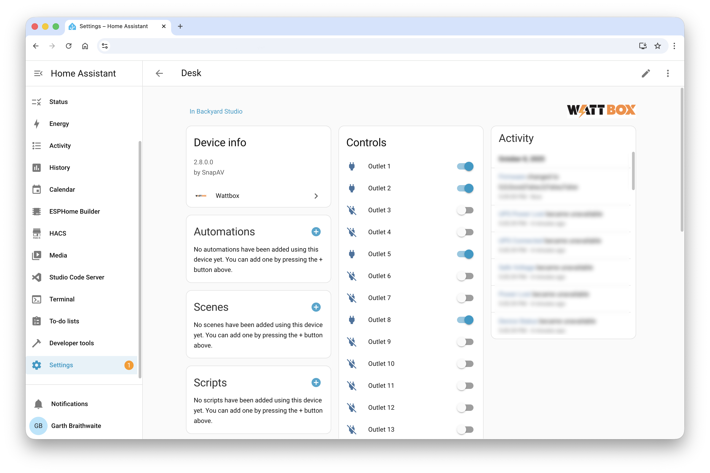

# Home Assistant Wattbox Integration

[](https://github.com/GarthDB/ha-wattbox/actions)
[](https://codecov.io/gh/GarthDB/ha-wattbox)
[](https://www.python.org/downloads/)
[](https://www.home-assistant.io/)
[](https://github.com/hacs/integration)
[](https://opensource.org/licenses/MIT)

A modern Home Assistant integration for SnapAV Wattbox 800 series power management devices using telnet communication.

> **Status**: ✅ Production Ready - See coverage badge above for current test coverage

## Screenshots

### HACS Discovery


### Setup Process


### Installation Success


### Device Integration


### Control Entities


### Monitoring Entities


## Why This Integration?

While there is an existing [hass-wattbox integration](https://github.com/eseglem/hass-wattbox/), this implementation provides several key improvements:

### **Modern Architecture**
- **UI Configuration**: Easy setup through Home Assistant UI vs. YAML-only configuration
- **Config Flow**: Proper integration setup wizard with validation
- **Modern Patterns**: Built using current Home Assistant integration standards

### **Enhanced Features**
- **Comprehensive Entity Support**: More sensor types and better entity organization
- **Robust Error Handling**: Graceful handling of connection issues and device unavailability
- **Real-time Updates**: Live data with proper coordinator pattern
- **Better Device Management**: Improved device info and entity relationships

### **Development Quality**
- **Extensive Testing**: 110+ tests with 82%+ coverage vs. limited testing
- **Active Maintenance**: Regular updates and bug fixes
- **Code Quality**: Modern Python patterns, type hints, and comprehensive linting
- **Documentation**: Detailed setup guides and troubleshooting

### **User Experience**
- **Easier Setup**: No YAML configuration required
- **Better Integration**: Proper device registry and entity organization
- **Reliable Operation**: Robust error handling and recovery
- **Future-Proof**: Built on modern Home Assistant patterns

## Features

- **Telnet Communication**: Direct telnet connection to Wattbox 800 series devices
- **Outlet Control**: Individual outlet on/off control and power cycling
- **Power Monitoring**: Real-time voltage, current, and power consumption monitoring
- **Status Indicators**: Device status, connectivity, and error monitoring
- **Auto Reboot Control**: Enable/disable auto-reboot functionality
- **HACS Compatible**: Easy installation through Home Assistant Community Store

## Supported Devices

- **Wattbox 800 Series**: WB-800VPS-IPVM-18 and compatible models
- **Protocol**: Telnet (port 23)
- **Authentication**: Username/password based

## Installation

### HACS (Recommended)

1. Open HACS in Home Assistant
2. Go to Integrations
3. Click "+ Explore & Download Repositories"
4. Search for "Wattbox"
5. Click "Download"
6. Restart Home Assistant

### Manual Installation

1. Download the latest release
2. Extract to `custom_components/wattbox/` in your Home Assistant config
3. Restart Home Assistant
4. Add the integration through the UI

## Configuration

1. Go to Settings > Devices & Services
2. Click "Add Integration"
3. Search for "Wattbox"
4. Enter your device details:
   - **Host**: IP address of your Wattbox device
   - **Username**: Device username (default: wattbox)
   - **Password**: Device password (default: wattbox)
   - **Polling Interval**: How often to update data (default: 30 seconds)

## Entities

### Switches
- **Outlet 1-18**: Individual outlet control
- **Master Power**: Control all outlets at once
- **Auto Reboot**: Enable/disable auto-reboot functionality

### Sensors
- **Voltage**: Current voltage reading
- **Current**: Current amperage reading
- **Power**: Current power consumption
- **Firmware Version**: Device firmware version
- **Model**: Device model information
- **Serial Number**: Device serial number
- **Hostname**: Device hostname

### Binary Sensors
- **Device Status**: Device online/offline status
- **Power Lost**: Power loss detection
- **Safe Voltage**: Voltage within safe range
- **Cloud Connectivity**: Cloud connection status

## Development

### Prerequisites

- Python 3.9+
- Home Assistant 2023.1.0+
- Wattbox 800 series device for testing

### Setup Development Environment

```bash
# Clone the repository
git clone https://github.com/GarthDB/ha-wattbox.git
cd ha-wattbox

# Install development dependencies
pip install -r requirements-dev.txt

# Run tests
make test

# Run all checks (linting, formatting, tests)
make check-all

# Format code
make format
```

### Local CI Testing

This project includes `act` CLI support for local GitHub Actions testing:

```bash
# Test the full CI pipeline locally
act -j test

# Test specific Python versions
act -j test -P ubuntu-latest=catthehacker/ubuntu:act-latest
```

### Development Tools

This project includes comprehensive development tooling:

- **Pre-commit Hooks**: Automated code formatting and linting
- **Makefile**: Common development commands (`make test`, `make lint`, `make format`)
- **Local CI Testing**: `act` CLI for testing GitHub Actions locally
- **Code Quality**: Black, isort, flake8, mypy, bandit, safety, vulture
- **Testing**: pytest with comprehensive test coverage
- **CI/CD**: GitHub Actions with multi-Python version testing

### Project Structure

```
ha-wattbox/
├── custom_components/
│   └── wattbox/
│       ├── __init__.py
│       ├── config_flow.py
│       ├── const.py
│       ├── coordinator.py
│       ├── entity.py
│       ├── manifest.json
│       ├── sensor.py
│       ├── switch.py
│       ├── binary_sensor.py
│       ├── telnet_client.py
│       ├── icon.png
│       ├── icon@2x.png
│       ├── logo.png
│       ├── logo@2x.png
│       └── hacs.json
├── docs/
│   ├── screenshots/
│   │   ├── 01-hacs-discovery.png
│   │   ├── 02-setup-process.png
│   │   ├── 03-installation-success.png
│   │   ├── 04-device-integration.png
│   │   ├── 05-control-entities.png
│   │   └── 06-monitoring-entities.png
│   ├── HACS_INTEGRATION_GUIDE.md
│   ├── INTEGRATION_TEST_RESULTS.md
│   └── snapav-2.7.0.4.md
├── tests/
├── .github/workflows/
├── .pre-commit-config.yaml
├── Makefile
├── requirements-dev.txt
├── pyproject.toml
└── README.md
```

## Contributing

1. Fork the repository
2. Create a feature branch
3. Make your changes
4. Add tests for new functionality
5. Submit a pull request

## License

This project is licensed under the MIT License - see the [LICENSE](LICENSE) file for details.

## Acknowledgments

- Based on the [bitfocus/companion-module-snapav-wattbox](https://github.com/bitfocus/companion-module-snapav-wattbox) telnet implementation
- Inspired by the [eseglem/hass-wattbox](https://github.com/eseglem/hass-wattbox) integration, but completely rewritten with modern Home Assistant patterns
- Built for the Home Assistant community with focus on reliability and ease of use

## Support

- **Issues**: [GitHub Issues](https://github.com/garthdb/ha-wattbox/issues)
- **Discussions**: [GitHub Discussions](https://github.com/garthdb/ha-wattbox/discussions)
- **Home Assistant Community**: [Community Forum](https://community.home-assistant.io/)

## Changelog

### v0.1.0 (Planned)
- Initial release
- Telnet communication support
- Basic outlet control
- Power monitoring
- HACS compatibility
# Test CI/CD
